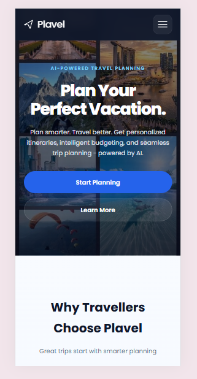

# Plavel Landing Page

A responsive landing page for Plavel, the smart travel planner app.

## Description

Plavel is an AI-powered travel planning tool that helps users build personalized itineraries, organize travel plans, and manage budgets efficiently. This landing page showcases the features and encourages sign-ups for the app.

## Preview




## App Features

- **Smart Itinerary Planner**: Build personalized day-by-day travel plans with optimized routes, curated activities, and smooth scheduling.
- **Budget Tracker**: Plan smarter with real-time expense tracking, budget control, and cost-efficient travel planning.
- **Stay Recommendations**: Find hotels and stays tailored to your preferences, location, and travel style.
- **AI Travel Assistant**: Get instant travel help, smart suggestions, and personalized planning powered by AI.

## Landing Page Features

- **Responsive Design**: Optimized for desktop, tablet, and mobile devices.
- **Modern UI**: Clean, intuitive interface with Font Awesome icons and Google Fonts.
- **Accessibility**: Includes skip links and proper ARIA labels for better usability.
- **Interactive Elements**: Hamburger menu for mobile navigation.

## Technologies Used

- HTML5
- CSS3
- JavaScript (for menu toggle)
- Font Awesome
- Google Fonts (Poppins)

## Installation

1. Clone the repository:
   ```
   git clone https://github.com/isha-hanaan/synent-task2-landingpage-isha.git
   ```
2. Navigate to the project directory:
   ```
   cd synent-task2-landingpage-isha
   ```
3. Open `index.html` in your web browser.

No additional dependencies or build steps are required as this is a static site.

## Usage

Simply open the `index.html` file in any modern web browser to view the landing page. The page is self-contained and does not require a server.

## Author
Isha Hanaan